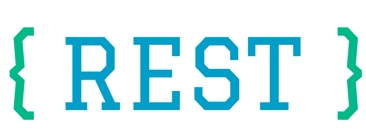

# Rest CLI   [](https://travis-ci.org/loint/rest-cli) [](https://badge.fury.io/py/rest-cli) [](https://loint.github.io/rest-cli/index.md)



If you love ?
- Beautiful restful web service with **standard** architecture
- The **fastest** way to get things done with less human coding
- Easy way to **synchronize** from components to documentation
- Well tested structure with **explicit** request & response
- Powered by an **industrial** framework with outstanding performance

Then this powerful tool is the right choice for you.

### Prerequisite
- Docker
- Python 2.7 with pip
- PHP 7.2 with composer

### Installation
```
$ pip install rest-cli
```

### Road map
- [x] Create web service base on a lightweight skeleton
- [x] Database schema migration
- [x] Reverse schema to model - repository - service and dependency injectors
- [x] Support built-in query annotations
- [x] Compile api routes and generate controller with integration tests
- [x] Serve and test application
- [x] Generate swagger documentation base on api routes (in-progress)
- [ ] Support response header & type casting for complex Request
- [ ] Support Service - Repository symbolic link to comply top down architecture
- [ ] Export service interfaces for inter-communication
- [ ] Support RPC exception via response verification

### Usages
1. Create web service application
- --quite : Quite mode without asking anything about configuration
- --force : Force creating application without complaining about existing project
- --mysql : Start a mysql container with default information
```
$ rest create <awesome-service>
```
2. Change directory to service and write some migrations at `src/Shared/Migration`
```
$ rest migrate
```
3. Synchronize model - repository - service - controller - test cases
- To create some awesome apis, update your routes at `config/api/*.json`
```
$ rest sync
```
4. View route list
- To see which routes are configured and manage apis
```
$ rest route
```
5. Serve your application to test in browser
```
$ rest serve
```
6. Test your application with PHPUnit
```
$ rest test
```
7. Check current version
```
$ rest version
```
8. Update new version of rest-cli ?
```
$ rest upgrade
```
9. Need more help ?
```
$ rest --help
```
### API Documentation
After `rest sync` you can serve your service with `rest serve`
Swagger Documentation should be ready at [http://localhost:8000/docs](http://localhost:8000/docs)

### License
Rest CLI and related projects are licensed under the [MIT](LICENSE)
Thanks for the sponsor from [GO1 Company](http://go1.com)

Happy Coding